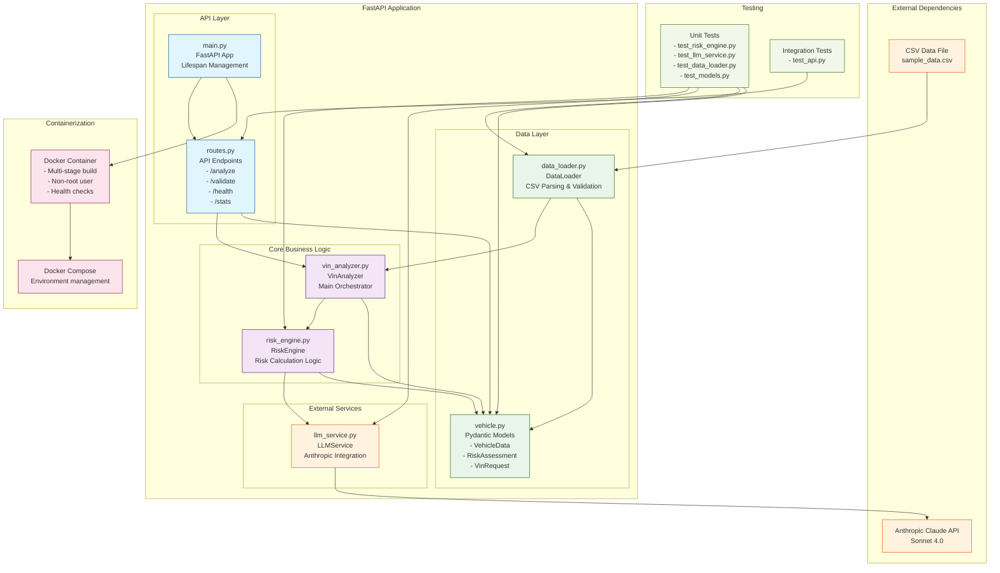
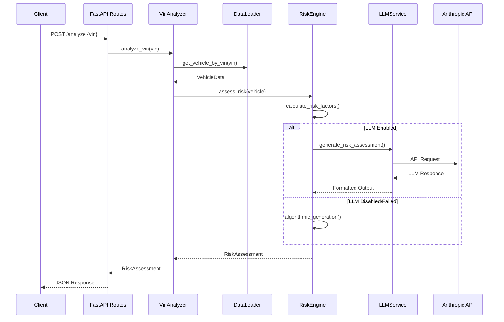
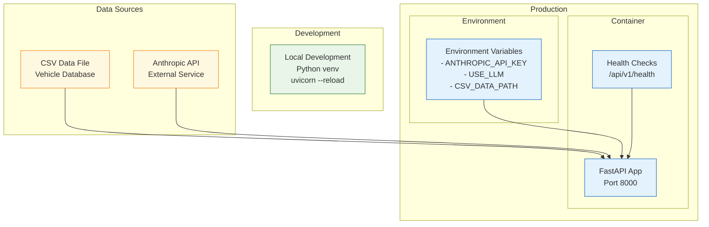

# VIN Risk Analyzer - Architecture Diagram

## System Architecture

## Component Descriptions

### API Layer
- **main.py**: FastAPI application entry point with lifespan management, CORS, and startup/shutdown logic
- **routes.py**: REST API endpoints with comprehensive error handling and validation

### Core Business Logic
- **vin_analyzer.py**: Main orchestrator that coordinates between data loading, risk calculation, and LLM services
- **risk_engine.py**: Implements the weighted risk scoring algorithm with multiple factors and fallback mechanisms

### Data Layer
- **data_loader.py**: Handles CSV parsing, data cleaning, and vehicle lookup operations
- **vehicle.py**: Pydantic models for data validation and serialization

### External Services
- **llm_service.py**: Manages integration with Anthropic Claude API for natural language generation

### Key Features
- **Graceful Degradation**: LLM failures fall back to algorithmic output generation
- **Comprehensive Validation**: Input validation at multiple layers using Pydantic
- **Error Handling**: Structured error responses with appropriate HTTP status codes
- **Health Monitoring**: Health check endpoints with database statistics
- **Containerization**: Production-ready Docker setup with security best practices

## Risk Scoring Algorithm

```mermaid
graph LR
    START[Base Score: 5] --> DOL[Days on Lot<br/>-2 to +2]
    DOL --> PRICE[Price to Market<br/>-2 to +2]
    PRICE --> VIEWS[VDP Views<br/>-1 to +1]
    VIEWS --> MILEAGE[Mileage Impact<br/>-1 to +1]
    MILEAGE --> SALES[Sales Opportunities<br/>-1 to +1]
    SALES --> CLAMP[Clamp to 1-10]
    CLAMP --> FINAL[Final Risk Score]

    classDef score fill:#e3f2fd,stroke:#0277bd
    classDef factor fill:#f9fbe7,stroke:#827717
    classDef result fill:#ffebee,stroke:#c62828

    class START,FINAL result
    class DOL,PRICE,VIEWS,MILEAGE,SALES factor
    class CLAMP score
```

## Data Flow

## Deployment Architecture

